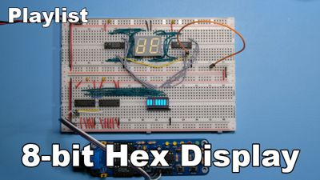

# 8-bit Hex Display

An 8-bit hexadecimal display module for breadboards. Watch the series on YouTube:

## Goals

The purpose of this project is to learn about 7-segment displays, and build a compact module to display 8-bit quantities on breadboard computers.

We will go through various technique to drive such displays, starting with decimal (74LS47), moving on to a vintage hexadecimal decoder (MC14495),
then to programmable logic (ATF16V8 SPLD) and finally we'll build a custom Arduino circuit that we'll miniaturize under the display,
to create a very compact module.

## Schematic

## BOM

### Basics

- BusBoard BB830 Breadboards
- Hook-Up Wire: [Recommended option](https://www.jameco.com/z/JMS9313-01D-Jameco-Valuepro-22-AWG-6-Color-Solid-Tinned-Copper-Hook-Up-Wire-Assortment-100-Feet_2183752.html)
- Male-to-Male Dupont Wires
- [Dupont Female Connectors](https://www.aliexpress.com/item/4001362869482.html). Use them to replace single connectors and group your cables by 2, 8...
- 10uF Polarized capacitors. Sprinkle one per power rail
- LED Bars with 8 LEDs ([Red version](https://www.aliexpress.com/item/32315190808.html)), with [9-pin bussed 1k resistors](https://nl.mouser.com/ProductDetail/Bourns/4609M-101-102LF?qs=nFt9sTYf7TDihA0IqmqOVw%3D%3D). I use 1k, 1.5k or 3.3k resistors depending on the color.

### KiCad components

**Component Count:** 28

| Refs | Qty | Component | Description |
| ----- | --- | ---- | ----------- |
| BAR1 | 1 | LED-BAR-8 | BAR GRAPH 8 segment block, high efficiency red |
| C1 | 1 | 10u | Polarized capacitor, small symbol |
| C2, C3, C4, C5, C6 | 5 | 100n | Unpolarized capacitor, small symbol |
| R1, R2, R3, R4, R5, R6, R7, R8, R9, R10, R11, R12, R13, R14 | 14 | 280 | Resistor, small symbol |
| RN1 | 1 | 1.5k | 8 resistor network, star topology, bussed resistors, small symbol |
| U1, U2 | 2 | 74HC163 | Synchronous 4-bit programmable binary Counter |
| U3 | 1 | 74HC10 | Triple 3-input NAND |
| U4 | 1 | DA04-11SRWA | Double 7 segment super bright red LED common anode |
| U5, U6 | 2 | 74LS47 | BCD to 7-segment Driver, Open Collector, 30V outputs |
